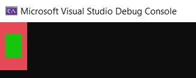
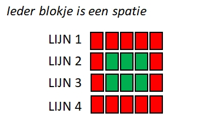


Kijk pas naar de oplossing als je 100% klaar bent. En zelfs dan, wees erg kritisch over jouw oplossing tegenover de modeloplossing. Vraag hulp aan de lector bij de minste twijfel die je hebt wanneer je jouw oplossing vergelijkt me de modeloplossing! 



## Rommel zin

Schrijf een applicatie met behulp van ``ReadLine()`` en ``WriteLine()``-methoden waarbij de computer aan de gebruiker om zijn of haar favoriete kleur, eten, auto, film en boek vraagt. Het programma zal de antwoorden echter door elkaar halen waardoor de computer vervolgens toont: 

<!---{line-numbers:false}--->
```text
Je favoriete kleur is [eten]. Je eet graag [auto]. Je lievelingsfilm is [boek] en je favoriete boek is [kleur].
```

Waarbij tussen de rechte haakjes steeds de invoer komt die de gebruiker eerder opgaf voor de bijhorende vraag.

Maak het programma "grappig" door de antwoorden op de verkeerde plek te gebruiken, bijvoorbeeld: "Zo, je favoriete kleur is The Lord of the Rings?!".

## Kleuren veranderen

Kan je je programma van zonet aanpassen zodat iedere zin in een andere kleur is?

Bekijk de werking van Console.Write(). Kan je ieder woord in een andere kleur zetten?

Go nuts!

## Visitekaart

Schrijf een programma dat aan de gebruiker de volgende zaken vraagt:

* Voornaam
* Achternaam
* Adres
* Hobby
* Waarom voor de opleiding gekozen?
* Waarom voor AP gekozen?

Vervolgens toon je de antwoorden op het scherm met telkens ervoor wat de vraag was in een andere klaar:

Bijvoorbeeld:

```text
Wat is je voornaam?
Tim
Wat is je achternaam?
Dams
Waar woon je?
Scheve dreef 666
Wat is je hobby?
lezen en schrijven
Waarom koos je voor deze opleiding?
Beste lectoren ooit
Waarom koos je voor AP?
Ik woon er dichtbij

Goed. Hier volgt je visite kaartje"

Naam: Tim Dams
Adres: Scheve dreef 666
Hobby: lezen en schrijven
Waarom deze opleiding volgen: Beste lectoren ooit.
Waarom op AP: Ik woon er dichtbij.
```

<!---{pagebreak}--->

## Tekening

Kan je volgende afbeeldingen namaken in de console?



Volgende tekening toont een schematische weergave:




Je kan een gekleurd vakje 'tekenen' door de ``BackGroundColor`` van de console in te stellen en dan een **spatie** naar het scherm te sturen.


## Muziek

Met de ``Console.Beep()`` methode kan je muziek maken. Volgende voorbeeld toont bijvoorbeeld hoe je do-re-mi-fa-sol-la-si-do afspeelt:

```java
Console.Beep(264, 1000);
Console.Beep(297, 1000);
Console.Beep(330, 1000);
Console.Beep(352, 1000);
Console.Beep(396, 1000);
Console.Beep(440, 1000);
Console.Beep(495, 1000);
Console.Beep(528, 1000);
```

Je geeft aan ``Beep`` 2 getallen mee (*argumenten*):

1. De frequentie van de toon die moet afgespeeld worden. Bijvoorbeeld 264 (in Hertz, hz).
2. De duur dat de toon moet afgespeeld worden in milliseconden. Als je dus 1000 meegeeft zal de toon gedurende 1000 ms, oftewel 1 seconde, afgespeeld worden.

Open 1 van de eerder gemaakte oefeningen en zorg ervoor dat bij het opstarten ervan er een kort, door jezelf gecomponeerd, introliedje wordt afgespeeld.

