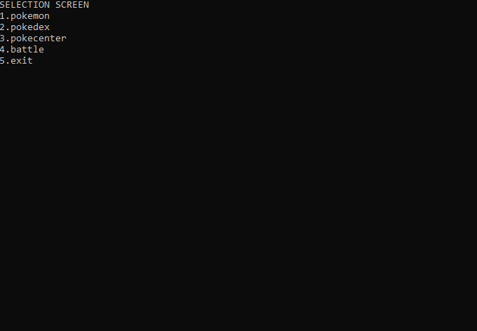

# Meetlat constructor (*Essential*)

Vul de ``Meetlat`` klasse uit het vorige hoofdstuk aan met een constructor. De constructor laat toe om de lengte in meter als parameter mee te geven. De ``LengteInMeter`` write-only property vervang je door een private instantievariabele ``double lengteInMeter``.

``lengteInMeter`` stel je nu in via de parameter die je in de constructor meekrijgt.

# Bibliotheek constructor en static (*Essential*)

Pas de Bibliotheek klasse aan uit hoofdstuk 8 zodat deze een default constructor heeft. In de default constructor zorg je ervoor dat de ``Uitgeleend`` property standaard de huidige tijd krijgt van het moment waarop het object werd aangemaakt.

Voeg ook een overloaded constructor mee die een ``DateTime`` object als parameter aanvaardt. Deze parameter zal toegewezen worden aan ``Uitgeleend``.

* Een ``static`` methode ``VeranderAlgemeneUitleenTermijn`` , die 1 ``int`` als parameter aanvaardt.De methode zorgt ervoor dat het aantal dagen dat je boek mag uitlenen verandert wordt naar de meegeven parameter. Tip: dit zal vereisen dat je een static instantievariabele hebt die je vervolgens in je ``InleverDatum`` getter gebruikt.

# Digitale kluis (*Essential*)

## Basiskluis


[Maak je oplossing in een kopie van volgende solution met bijhorende unittests](https://github.com/timdams/ZIESCHERPER_TESTS_H3_DigitaleKluis).


Maak een klasse ``DigitaleKluis`` die we gaan gebruiken om een kluis voor te stellen.

De klasse heeft volgende elementen:

* Een fullproperty ``Code`` met private set. De get van deze property zal altijd -666 teruggeven, tenzij ``CanShowcode`` op ``true`` staat, in dit geval zal de effectieve code worden terug gegeven die in de bijhorende instantievariabele  ``code`` staat. 
* Een overloaded constructor die als parameter een geheel getal toelaat. Dit getal zal worden toegewezen aan ``Code`` en is dus de toegangscode 
* Een autoproperty ``CanShowCode`` type bool, om aan te geven of de code van buitenuit kan gezien worden.
* Een read-only property ``CodeLevel`` van type ``int``. Deze property zal het level van de code teruggeven (ongeacht CanShowCode). Het level is eenvoudigweg de effectieve code gedeeld door 1000 als geheel getal (dus indien de code 500 is zal 0 worden teruggegeven, indien de code 2000 is wordt 2 teruggegeven, etc.) 
* Een private variabele ``aantalPogingen`` om bij te houden hoe vaak de gebruiker geprobeerd heeft de code te vinden.
* Een methode ``TryCode`` die een geheel getal als parameter aanvaardt. De methode geeft een ``true`` terug indien de code correct was, anders ``false``. Deze methode kan gebruikt worden om extern een code te testen , indien deze overeenkomt met de bewaarde code dan zal gemeld worden dat de code geldig is en wordt ook getoond hoeveel keer de gebruiker geprobeerd heeft ``Deze code is geldig. Aantalpogingen = 5``. Indien de gebruiker -666 meegaf dan  verschijnt er ``CHEATER`` op het scherm. Indien de gebruiker een foute code meegaf dan meldt de methode dat dit een foute code was (``"geen geldige code"``) en wordt het aantal pogingen met 1 verhoogd.  Deze methode kan maar 10 keer aangeroepen worden (ongeacht of de juiste code werd meegegeven of niet).Indien dus ``aantalPogingen`` 10 of meer is zal er op het scherm verschijnen ``Je hebt je 10 pogingen opgebruikt.Sorry.``.


Maak enkele Digitale Kluis objecten aan in je ``main`` en test of je bovenstaande klasse correct is geïmplementeerd.

## Kluizen kraken 

Voeg aan de klasse een ``static`` methode ``BruteForce`` toe waar je een kluis-object aan kan geven. De methode zal een aantal random codes brute forcen (met een loop die 10 verschillende getallen test) door telkens de ``TryCode`` methode van de meegegeven kluis aan te roepen. Wanneer toevallig de juiste code werd gevonden zal het aantal pogingen getoond worden.



*Beeld je in dat Bruteforce een student is. Ik maak een kluis-object aan en vertel aan die student niet welke code ik heb gekozen. Vervolgens geef ik hem mijn object en zeg hem "Je krijgt 10 pogingen om met TryCode de kluiscode te raden. Succes!"*



### Toelichting

De ``BruteForce``methode is ``static`` en heeft dus geen informatie over de interne staat van een Kluis-object. Vind je dit verwarrend? Maak deze methode dan aan in je hoofdprogramma (Program.cs): ``public static void BruteForce(DigitaleKluis testKluis)`` en zorg ervoor dat ze daar werkt. De methode zal dus 10 keer TryCode aanroepen op de ``testKluis``, telkens met een andere getal. Enkel wanneer TryCode ``true`` teruggeeft weet je dat je de juiste code hebt gevonden (merk op dat de kans erg klein is dat in 10 beurten dit zal gevonden worden). 

In je main moet dit dus werken:

```java
DigitaleKluis kluisje = new DigitaleKluis(2342);
BruteForce(kluisje);
```

Vervolgens verplaats je de methode naar je klasse ``DigitaleKluis`` en pas je de aanroep ervan aan in je Main:

```java
DigitaleKluis kluisje = new DigitaleKluis(2342);
DigitaleKluis.BruteForce(kluisje);
```

Je hebt de oefening nu opgelost :)


# Pokémon deel 2 (*Essential*)

## Constructors

Pas de kennis van constructors toe op je Pokémon-project uit het vorige hoofdstuk. Zorg ervoor dat je Pokémon op 3 manieren kunt aanmaken als volgt:

* Via een default constructor: alle base stats worden daarbij op 10 standaard ingesteld via de constructor
* Via een overloaded constructor die de gebruiker toelaat om de 6 base stats als parameters mee te geven (bv ``new Pokemon(45,42,50,65,34,67)``)
* Via object initializer syntax waarbij je eender welke base stat etc. kunt instellen (bv ``new Pokemon(){HP_Base=40, Name="Pikachu"};``)


Het is ook logischer dat je van de base_stats een full property met **private** setter maakt, daar we die waarden nooit nog mogen aanpassen nadat de constructor werd aangeroepen.


## Static methoden

* Verhuis de methoden (``GeneratorPokemon`` en ``Battle``) die je maakte in deel 3 van de Pokémon-opdracht in vorige hoofdstuk naar de klasse ``Pokemon`` zelf en test of deze nog steeds werkt. (Is dit een logischere plek?)
* Voeg enkele static properties met private set toe om bij te houden:
    * Hoe vaak een Pokémon z'n level werd verhoogd (dus telkens bij aanroep van ``VerhoogLevel``)
    * Hoe veel Battles er al zijn geweest (verhoogt telkens ``Battle`` wordt uitgevoerd)
    * Hoe vaak een battle resulteerde in gelijkstand (verhoogd bij gelijkstand in  ``Battle``)
    * Hoe veel random Pokémon werden aangemaakt (verhoogt telkens ``GeneratorPokemon`` wordt aangeroepen)
* Maak een static methode ``Info`` die deze properties als een soort samenvatting naar het scherm stuurt
* Maak een static property ``NoLevelingAllowed`` aan van het type bool. Deze kan van buiten de klasse aangepast worden. Indien deze bool op ``true`` staat kunnen Pokémon hun level niet verhoogd worden. Wanneer in dit geval ``VerhoogLevel`` wordt aangeroepen zal er een foutboodschap op het scherm komen.

Toon in je hoofdprogramma aan dat je kunt werken met deze static methoden en properties.



Student Kevin Van Rooy maakte volgende applicatie waarbij bovenstaande opgave als initiële inspiratie diende:





## Natures (PRO)

In generatie 3 werd het concept Natures geïntroduceerd. Afhankelijk van deze eigenschap zullen bepaalde full stats van een Pokémon met 10% verhoogd of verlaagd worden.

Een Pokémon krijgt bij de constructie steeds 1 van de 25 onderstaande natures willekeurig toegewezen en zal vervolgens bij impact hebben op 2 full stats.

Gebruik je kennis van ``Enum``, constructors en properties om dit concept in je Pokemon klasse te implementeren.

| **Nature** | **Verhoogt met 10%** | **Verlaagt met 10** |
|---|---|---|
| Adamant	 | Attack	 | Sp. Atk
| Bashful	 | Sp. Atk	 | Sp. Atk
| Bold  | Defense	 | Attack
| Brave  | Attack	 | Speed
| Calm  | Sp. Def	 | Attack
| Careful	 | Sp. Def	 | Sp. Atk
| Docile  | Defense	 | Defense
| Gentle  | Sp. Def	 | Defense
| Hardy  | Attack	 | Attack
| Hasty  | Speed  | Defense
| Impish  | Defense	 | Sp. Atk
| Jolly  | Speed  | Sp. Atk
| Lax  | Defense	 | Sp. Def
| Lonely  | Attack	 | Defense
| Mild  | Sp. Atk	 | Defense
| Modest  | Sp. Atk	 | Attack
| Naive  | Speed  | Sp. Def
| Naughty	 | Attack	 | Sp. Def
| Quiet  | Sp. Atk	 | Speed
| Quirky  | Sp. Def	 | Sp. Def
| Rash  | Sp. Atk	 | Sp. Def
| Relaxed	 | Defense	 | Speed
| Sassy  | Sp. Def	 | Speed
| Serious	 | Speed  | Speed
| Timid  | Speed  | Attack



Het is aangeraden dat je met een extra methode werkt die een waarde 0,10 of -10 zal teruggeven. Deze methode kan je dan gebruiken in de get van je full stat properties zodat deze code zo compact mogelijk blijft.


[Volgende artikel lijst de natures op en beschrijft hoe ze werken](https://pokemondb.net/mechanics/natures)

([meer indepth informatie in dit artikel](https://bulbapedia.bulbagarden.net/wiki/Nature))

# Sport simulator
Haal je ``Sportspeler`` klasse van van het vorige hoofdstuk boven en voeg volgende statische methode er aan toe (vervang het soort speler door de naam van jouw klasse. Mijn klasse noemde ``Waterpolospeler``)

## Schrijf een methode genaamd:
``static void SimuleerSpeler(Waterpolospeler testspeler)``

(vervang dus Waterpolospeler door de klasse die je zelf hebt gemaakt)

De SimuleerSpeler-methode zal beide methoden van je klasse telkens 3x aanroepen m.b.v. een for-loop in de methode (dus in mijn geval 3x GooiBal en 3xWatertrappen)

Test je methode door 2 objecten aan te maken en telkens mee te geven als parameter.

## Maak een tweede methode
``static void SimuleerWedstrijd(Waterpolospeler speler1, Waterpolospeler speler2)``

Bij aanroep van de methode verschijnt er op het scherm wie van beide speler zou winnen als ze zouden spelen. Gebruik een random uitkomst om te bepalen over speler 1 of 2 wint. Toon op het scherm "Speler 1 wint." Gevolg door de aanroep van iedere methode van die speler.

## Maak een derde methode
``static Waterpolospeler BesteSpeler(Waterpolospeler speler1, Waterpolospeler speler2)``

Deze methode gaat ook random bepalen welke speler de beste is. Vervolgens geef je deze speler terug als resultaat. In de main roep je vervolgens iedere methode van dit object aan.
