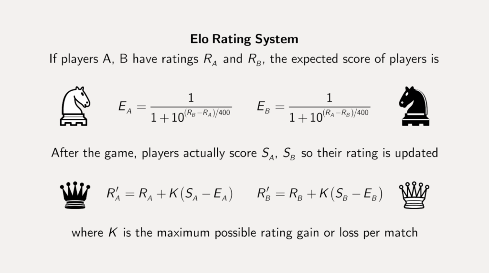

# Hoofdstuk 4


**Gebruik je kennis van debuggen om vanaf dit hoofstuk problemen op te lossen. Gebruik niet ``Console.WriteLine()`` om de waarde van een variabele te controleren at-runtime, maar gebruik daarentegen breakpoints!**


## Supercomputer


Vanaf dit punt zullen  de meeste oefeningen iets "vragen" aan de gebruiker. Hiermee wordt bedoeld dat je de gebruikerinput via ``ReadLine`` moet inlezen en indien nodig moet converteren naar het gewenste type.


Vraag aan de gebruiker 3 kommagetallen. Bereken het gemiddelde van deze 3 getallen.

## Vierkant (*Essential*)
Schrijf een programma om de omtrek en de oppervlakte van een vierkant te bepalen. De zijde wordt ingelezen. Zorg ervoor dat de uitvoer er als volgt uitziet:

```text
zijde: … 
omtrek: … 
oppervlakte: …
```

## Schaak-ELO (*Essential*)

> Sinds 2022 en de sappige verhalen rond Magnus en Niemann is schaken erg populair aan het worden bij "de massa". Tijd om hier dus een oefening rond te maken.

*"Een Elo-rating is een getalsmatige aanduiding van de sterkte van een speler. Het wordt het meest gebruikt in schaken, dammen en go, maar kan in principe gebruikt worden bij elke sport waarbij spelers 1 tegen 1 spelen."* (bron Wikipedia). We gaan een applicatie schrijven (zie verderop voor de effectieve werking van de applicatie) die: 

1° De verwachte score (Ea en Eb) berekend indien 2 spelers tegen elkaar gaan spelen, gebaseerd op hun ELO-rating (Ra en Rb) die je aaplicatie aan de gebruiker vraagt.
2° Berekenen van hun nieuwe Elo score (R'a en R'b) gebaseerd op de effectieve uitslag (Sa en Sb). 

Volgende afbeelding ([bron](https://www.coorpacademy.com/en/blog/learning-innovation-en/elo-whos-the-best/)) toont beide stappen:


Opmerkingen bij deze formules:

* De waarde K mag je standaard op 10 zetten (dit geeft aan dat er maximum 10 Elo-punten kunnen bijkomen of afgaan).
* De eindscore (Sa en Sb) is als volgt: 1 voor een win, 0,5 voor gelijkstond, 0 voor verlies.
* **Gebruik voor ALLES dobules.**
* De finale, nieuwe, rating wordt afgerond tot 0 cijfers na de komma. 

### Getalvoorbeeld:

Indien speler A een rating van 1000 heeft en B 1100 dan zal speler A na een gewonnen wedstrijd een rating van 1006 krijgen en speler B 1094.

### Applicatie

Schrijf een applicatie die eerst de Elo-ratings van beide spelers vraagt.
Vervolgens toont de applicatie de nieuwe Elo-ratings voor de 3 scenario's:
* Indien speler A wint.
* Indien speler B wint.
* Indien er een gelijke stand (draw) is.

#### K vragen

Breidt de applicatie uit en vraag de waarde K ook aan de gebruiker en gebruik deze in je berekeningen.


## Stacking Armor calculator

Volgende formule laat ons toe om je effectieve Health te berekenen in League Of Legends, gebaseerd op je armor:


Nominal health is de maximum health van je hero. Als je bijvoorbeeld 60 armor hebt en nominal health van 1000, dan is je effectieve health 1600.

Schrijf een programma dat aan de gebruiker volgende informatie vraagt:

* Nominal health
* Armor

Toon vervolgens de effectieve health van de gebruiker.

**Nominal health, armor en effective health zijn int en mogen geen doubles zijn.*

## Balk

Bereken de oppervlakte en de inhoud van een balk . De gegevens (hoogte, breedte, lengte) worden ingelezen. Zorg ervoor dat de uitvoer er als volgt uitziet (met de puntjes vervangen door de effectieve jusite waarden):

```text
lengte: … 
breedte: … 
hoogte: … 
oppervlakte: … 
inhoud: … 
```

## Geometric-fun

Vraag aan de gebruiker een hoek in graden. Zet deze om naar radialen , gebruik ``Math.PI`` voor Pi. Gebruik vervolgens de verschillende geometrische functies in de ``Math.`` bibliotheek om de sinus (``.Sin``), cosinus (``.Cos``) en tangens (``.Tan``) van de hoek aan de gebruiker te tonen 


Denk eraan: de methoden die met hoeken werken, werken in radialen, daarom moeten we deze eerst omzetten.
1 rad = 180°/PI = 57.295779513°.



Je zal merken dat voor bepaalde hoeken (bijvoorbeeld 90 graden) je erg kleine of erg grote waarden krijgt, dat is normaal. De geometrische functie in de Math-bibliotheek berekenen de resultaten (en werken dus niet met een tabel) wat met eindige kommagetallen ervoor zorgt dat je soms in plaats van 1 of 0 iets erg kleins of groot krijgt.


## BMI berekenaar (*Essential*)
Maak een programma dat aan de gebruiker z'n lengte en gewicht vraagt en vervolgens de berekende BMI (Body Mass Index) toont.
Gebruik ``Math.Round`` om de uitkomst tot maximum 2 cijfers na de komma te tonen.

Reken na met je rekenmachine of je uitkomst wel degelijk klopt!

## Op-de-poef (*Essential*)
Een vaste klant in je café bestelt altijd "op-de-poef". Dat wil zeggen dat hij niet onmiddellijk betaalt en dat z'n rekeningen worden neergeschreven. Ooit zal de klant dan gevraagd worden de hele som te betalen.

Schrijf een programma dat 5 keer na elkaar aan de barman vraagt om een bedrag in te voeren. Het ingevoerde bedrag wordt opgeteld bij wat er reeds op de rekening staat. Na 5 keer wordt de totale som getoond alsook hoeveel weken het duurt indien de klant wekelijks 10 euro afbetaalt.

Voorbeeldwerking:


```text
Voer bedrag in?
12
De poef staat op 12 euro.
Voer bedrag in?
14
De poef staat op 26 euro.
Voer bedrag in?
3
De poef staat op 29 euro.
Voer bedrag in?
8
De poef staat op 37 euro.
Voer bedrag in?
2
De poef staat op 39 euro.
*************************
Het totaal van  de poef is 39 en zal 4 weken duren om volledig afbetaald te worden.
```


Voor deze oefening heb je ``Math.Ceiling()`` nodig. Deze methode zal een getal altijd naar boven afronden.



## Feestkassa (*Essential*)
De plaatselijke voetbalclub organiseert een mosselfestijn. Naast mosselen met frietjes (20 EUR) bieden ze voor de kinderen de mogelijkheid om een koninginnenhapje (10 EUR) te kiezen. Verder is er een ijsje als nagerecht voorzien (3 EUR). Om het gemakkelijk te maken kosten alle dranken 2 EUR.


Ontwerp een applicatie zodat de vrijwilliger aan de kassa alleen maar de juiste aantallen moet ingeven, lijn per lijn. (frietjes, koninginnenhapje, ijsje, drank) om de totaal te betalen prijs te berekenen. 

Het resultaat wordt als volgt weergegeven: ``Het totaal te betalen bedrag is x EURO``.

Voorbeeld:
```
Frietjes?
3   
Tussenprijs= 60 euro
koninginnenhapje?
5
Tussenprijs= 60 euro + 50 euro
Ijsjes?
2
Tussenprijs= 60 euro + 50 euro + 6 euro
Dranken?
5
Tussenprijs= 60 euro + 50 euro + 6 euro + 10 euro

Het totaal te betalen bedrag is 126 EURO.
```

## Het Orakeltje van Delphi (*Essential*)
Gebruik een random generator om een orakel (een duur woord voor waarzegger) te maken, namelijk de kleine broer of zus van het [Orakel van Delphi](https://nl.wikipedia.org/wiki/Orakel_van_Delphi). Het programma zal aan de gebruiker vertellen hoe lang deze nog zal leven. Bijvoorbeeld: "Je zal nog 15 jaar leven.".
 
Het orakel zal enkel realistische getallen geven. M.a.w., getallen van 5 tot en met 125 jaar.



We gaan geregeld een oefening in een later hoofdstuk verder uitbreiden. Het orakeltje van Delphi is er zo eentje. **Bewaar je oefeningen dus goed!**

