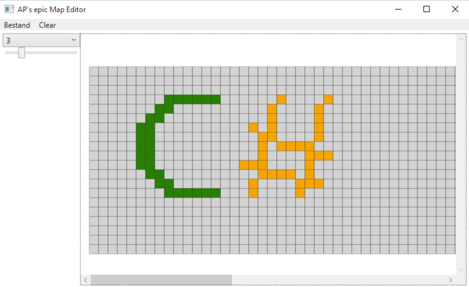

## MapEditor in WPF

Ga naar (deze site)[https://github.com/timdams/MapEditor_LearnSomeWPF] en volg de pdf daar. Deze oefening toont hoe je van start gaat met een console-applicatie en die dan stelselmatig zal omzetten naar een echte grafische Windows applicatie (WPF).

