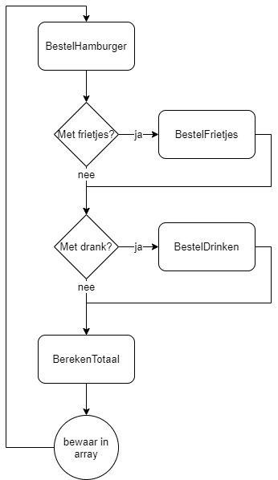

# Inleiding

Helaas, de Mac-DamsCamp slaagt niet aan. Toch heeft APDonalds™ je gevraagd om hun kassa-software grondig te vernieuwen. Aan jou de taak om de bestelling van een hamburger, met optioneel drank en frietjes, te stroomlijnen. Go get’m!

# Basis werking
Hier de algemene flow van de applicatie (merk op dat de methoden BestelFrietjes,BestelDrinken en BerekenTotaal allemaal vanuit BestelHamburger worden aangeroepen, wat later wordt uitgelegd)

 
De applicatie loopt oneindig door en kan dus niet afgesloten worden).

In de hoofdapplicatie bewaar je in een array (met grootte 100) van doubles telkens het resultaat van de BestelHamburger-methode. (met deze array doe je voor de rest niets).

# Methoden (10 p)

## BestelHamburger (3p)

1.	Deze methode toont het menu( zie onderaan) en heeft een double als resultaat. De methode vraagt eerst welke hamburger de gebruiker wenst. De gebruiker voert een string in voor z’n keuze (“gewoon”, “fish”, “veggie”). Zolang de gebruiker geen juist antwoord geeft wordt de vraag opnieuw gesteld en de input uitgelezen.
2.	Vervolgens dient de gebruiker met “j” of “n” te antwoorden of deze frietjes wilt .Indien ja dan wordt de methode “BestelFrietjes” aangeroepen.
3.	Vervolgens dient de gebruiker met “j” of “n” te antwoorden of deze frisdrank wenst. Indien ja dan wordt de methode “BestelDrinken” aangeroepen.
4.	Finaal roept deze methode de BerekenTotaalMethode aan en zal alle verzamelde informatie aan deze methode meegeven (zie verder). Het resultaat van de BerekenTotaalMethode (een double) wordt teruggegeven als resultaat van deze methode.

## BestelFrietjes (1p)

Deze methode vraagt hoeveel frietjes de gebruiker wenst en zal het resultaat (een getal) teruggeven als resultaat. De gebruiker voert een getal in tussen 1 en 10 (geen controle nodig) en dit getal geeft deze methode terug.

## BestelFrisdrank (2p)

De methode vraagt welke frisdrank de gebruiker wenst (zie menu), wederom voert de gebruiker een getal in. Dit getal wordt omgezet naar een enum van het type Frisdranken (met als waarden Water, Fanta, Cola) dat zal teruggeven als resultaat van de methode.
Berekentotaal (3p)
Deze methode geeft de prijs als double tot 2 cijfers na de komma op het scherm weer en zal deze waarde ook als return teruggeven. De methode aanvaardt volgende parameters:

1° hamburger, string, verplicht
2° aantalfrietjes, int, optioneel (standaard: 1)
3° drank, enum type Frisdranken, optioneel (standaard: “geen”) 

Volgende menukaart wordt gebruikt om met voorgaande informatie de totaalprijs te bereken.

De menukaart:
 
* Gewone hamburger: 	€5
* Fishburger:		€6
* Veggieburger:		€3
* Water			€2
* Fanta			€3
* Cola			€3
* Frietjes:		€2 per frietje
 
### Promoties

Volgende promoties zijn actief en worden toegepast indien relevant:

* Box: Indien de gebruiker én frisdrank én frietjes besteld krijgt hij 5€ korting op de totaalprijs.
* Hipster: Indien de gebruiker Water, een Veggieburger en 1 frietje besteld krijgt hij €3 korting op de totaalprijs.

Indien de gebruiker een promotie heeft gekozen dan wordt dit op het scherm getoond vlak voor de prijs wordt getoond. 

# Uitbreidingen (6p)

Voeg volgende uitbreidingen toe aan de applicatie.

**Visualisatie bestelling (2p)**: In de methode BerekenTotaal wordt de bestelling gevisualiseerd als volgt:
* Hamburger wordt voorgesteld als de letter “H” met als achtergrond groen bij gewone hamburger, blauw voor fish, rood voor veggie.
* Het aantal frietjes wordt voorgesteld als evenveel keer de letter “I” (hoofdletter i) als er frietjes zijn besteld.
* De frisdank wordt voorgesteld door een letter (“W” voor water, “F” voor Fanta, “C” voor cola)

Voorbeeld voor iemand met fishburger, 3 frietjes en fanta:

``text
HIIIF
``  

*(de H heeft een blauwe achtergrond)*

Vervolgens wordt de prijs en eventuele promotievermelding getoond

**HamburgerArrays (2p)**: Gebruik een array waarin alle type hamburgers staan die besteld kunnen worden. De prijs van de hamburger in de arrays is gelijk aan z’n index +1. (je mag dus de prijzen uit voorgaande menukaart negeren). Zorg ervoor dat je zoveel hamburgertypes als je zelf wenst in de arrays kunt toevoegen (en dus niet beperkt bent tot 3).

