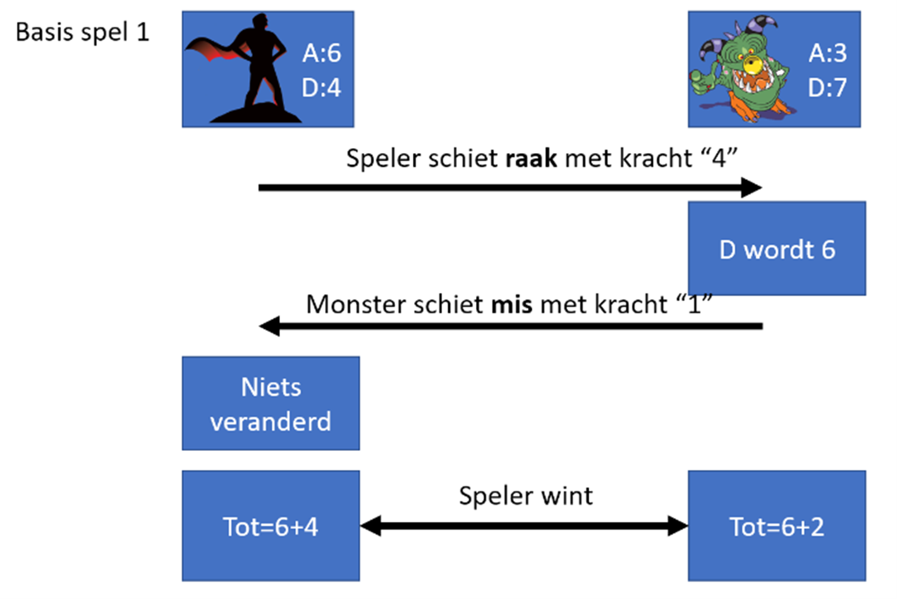
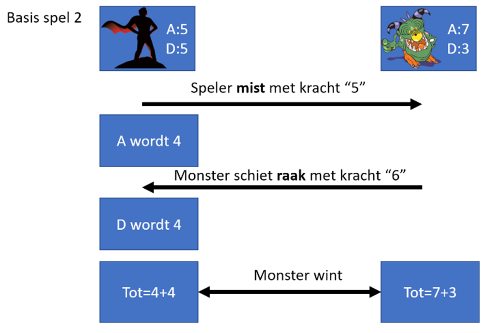

> Volgende opgave was de vaardigheidsproefopdracht voor het examen van dit vak (Programming Principles) in januari 2023
 
# Inleiding

Hoera. Je nieuw opgerichte bedrijf “Tornado” heeft z’n eerste contract binnen. Om de capaciteiten van je bedrijf aan te tonen heeft je klant gevraagd een spel, Underlook 2, te programmeren. Laat je niet afschrikken door de opgave van de klant: het gaat om een eenvoudig spelletje.
Doel
Het spel bestaat uit meerdere delen die je dient te maken, te weten:
1.	Deel 1: Een hero-generator (2punten)
2.	Deel 2: De hero-visualisatie (2 punten)
3.	Deel 3: Een trainingsmissie om het spel aan de speler duidelijk te maken (3 punten)
4.	Deel 4: Het spel zelf dat uit drie rondes bestaat (5 punten)
5.	Deel 5: Enkele uitbreidingen (4punten)

# Deel 0

PROTIP: lees eerst de gehele opgave tot het einde. Kijk goed na dat je alles hebt gelezen en niet als een ‘kieke zonder kop’ begint te programmeren.
PROTIP2: Het spel is eenvoudig, maar je klant heeft een nogal onduidelijke manier van opgave opgesteld. LEES DAAROM ZEKER DE APPENDIX ACHTERAAN WAAR HET SPEL EENVOUDIGER WORDT TOEGELICHT
 
# Deel 1: Hero-generator

Maak een hero-generator die 3 zaken zal generen, namelijk een naam, aantal aanval en aantal verdediging. Hoe?
1. Vraag aan de gebruiker ``"Wil je een random held genereren?(ja/nee)"``
2. Indien de gebruiker “nee” antwoordt dan heeft je held volgende standaard eigenschappen:
   * Aanval= 5
   * Verdediging= 5
   * Naam= “Default”
3. Indien de gebruiker “ja” antwoordt dan zal een willekeurige held aangemaakt worden, als volgt:
   * Aanval	=  willekeurig getal van 1 tot en met 9  
   * Verdediging = 10 – aanval 
              [als dus bij aanval 3 werd gegenereerd dan zal de verdediging 7 zijn]
   * Naam=  resultaat van de methode NaamGen.

**NaamGen-methode**

De Methode NaamGen heeft volgende eigenschappen:
* Aanvaardt geen parameters
* Geeft een string terug, namelijk de gegenereerde naam.
* Deze naam wordt willekeurige gekozen uit een array die vooraf gevuld werd met volgende 10  namen: TorBro, Vuilhard, Merci, Junkpoes, Genki, Ono, April, Yingyatta, Ombra en Lookup.
 

## Deel 2: Herovisualisatie
Dit is een kort deel. In dit deel roep je een methode “ToonHeld” aan die de , al dan niet willekeurig gegenereerde, held en z’n eigenschappen toont.

**ToonHeld-methode**

De methode ToonHeld heeft volgende eigenschappen:
* Retourneert niets. Toont enkel wat output in de console.
* Aanvaardt 3 parameters, namelijk een string voor de naam, en twee ints voor de aanval en verdediging
   * Deze drie parameters zijn de resultaten die je in Deel 1 hebt gemaakt en die je nu meegeeft aan deze methode.
   * De methode zal de Held-gegevens als volgt tonen, waarbij A de aanval is en D de verdediging:

```text
*****
Ombra
A=4
D=6
*****
```

Het aantal sterretjes boven en onder zijn even lang als de lengte van de held-naam.

Nog 3 voorbeelden:

```text 
*****
April
A=9
D=1
*****
```

```text
***
Ono
A=5
D=5
***
```

```text
*********
Yingyatta 
A=8
D=2
********
``` 

# Deel 3: Trainingsmissie
Dit deel roept 1 methode aan genaamd “DoeTraining”. Deze methode zal de speler een test-spel (Opgelet: het appendix achteraan dit document beschrijft de spelregels van het spel, zoals ze ook hieronder verwerkt werden) laten uitvoeren zodat de speler begrijpt hoe het spel werkt.

**DoeTraning-Methode**

Deze methode heeft volgende eigenschappen:
* Retourneert niets. Toont enkel output in de console.
* Aanvaardt 3 parameters, namelijk een string voor de naam, en twee ints voor de aanval en verdediging
   * Deze drie parameters zijn de resultaten die je in Deel 1 hebt gemaakt en die je nu meegeeft aan deze methode.

De werking van de methode is als volgt:

1.	Een oefenmonster wordt gemaakt dat aanval = 4 en verdediging = 6 heeft.
2.	Er wordt aan de speler gevraagd hoeveel hij wenst te schieten. Dit getal mag niet groter zijn dan de aanvalskracht van de speler (wat je in deel 1 hebt gemaakt) en minimum 1.
   *  De vraag toont ook tussen welk bereik van getallen de speler mag kiezen. [1 tot en met ‘aanvalskracht’)
   * Als dus de speler aanval 5 heeft dan worden enkel de getallen 1,2,3,4 en 5 aanvaardt.
   * Indien de speler een foutief getal invoert dan zal de vraag herhaald worden tot de speler een correct getal ingeeft.
3.	Er wordt nu gecontroleerd of de speler het monster raakt: enkel indien het gekozen getal maximum 1 afwijkt van de verdediging van het monster is dit raak.
   * Het monster in de training heeft standaard 6, dus enkel de getallen 5,6 en 7 worden aanvaardt.
   * Indien de speler raakt dan wordt de verdediging van het monster met 1 verlaagt.
   * Bij mis gebeurt er niets. (een held met lage aanval zal dit startmonster dus niet kunnen raken)
4.	Nu mag het monster aanvallen: het monster (de computer) kiest een willekeurig getal tussen 1 en de aanvalskracht van het monster (in de training dus tussen 1,2,3 en 4)
   * Indien het monster raakt dan wordt de verdediging van de speler met 1 verlaagd.
5.	Toon aan de speler de uitkomst van de training:
   * De speler wint indien de som van de speleraanval en spelerverdediging groter of gelijk is aan de som van de aanval en verdediging van het monster.

Voorbeeld output (na creatie van random held met aanval 2 en verdediging 8):

```text
---De training---
Hoeveel wil je schieten? (min=1, max=2)
2
Oei, gemist. Het monster heeft verdediging 6. Je had een getal tussen 5 en 7 moeten kiezen (als dat kon met je huidige aanvalskracht). 
Door te missen wordt je aanval met 1 verlaagt. 
Nu valt het monster aan.
Het valt aan met 4.
Oef, gemist. De aanvalskracht van het monster zakt.
Eens kijken wie wint. Diegene met de hoogste som van aantal en verdediging wint. Bij gelijke stand wint de held.
Het monster wint de training. 
```

# Deel 4: Het spel
De mogelijk verloren verdediging uit de training wordt bij aanvang van deze fase teniet gedaan. De speler heeft dus terug de aanval en verdediging zoals deze in deel 1 werd aangemaakt.
In dit deel zal de speler het spel effectief kunnen spelen.
In dit deel wordt een nieuwe methode “DoeGame” aangemaakt. 

**DoeGame-methode**

Deze methode heeft volgende eigenschappen:
* Retourneert niets. Toont enkel output in de console.
* Aanvaardt 3 parameters, namelijk een string voor de naam, en twee ints voor de aanval en verdediging
   * Deze drie parameters zijn de resultaten die je in Deel 1 hebt gemaakt en die je nu meegeeft aan deze methode.
   * De werking is iets complexer:
          * Eerst verschijnt de boodschap “Het spel gaat beginnen. Druk op enter om door te gaan.”
          * Nadat de speler op enter heeft geduwd wordt het console-scherm leeggemaakt.
          * Er wordt nu 3 keer een methode “DoeGevecht” aangeroepen  (zie verder). 
          * Deze methode zal telkens een bool terug geven om aan te geven of de speler wel of niet dit gevecht wint.
          * Na ieder gevecht krijgt de speler terug al z’n aanval en verdediging.
          * Na 3 gevechten wordt de score getoond aan de speler: de score is gewoon de som van het aantal van de 3 gewonnen gevechten. Als de speler 2 van de 3 wedstrijd won dan geeft de methode 2 terug.


**DoeGevecht-methode**

Deze methode heeft volgende eigenschappen:

* Retourneert een bool. Deze is true indien de speler het gevecht heeft gewonnen.
* Aanvaardt 2 parameters, twee ints voor de aanval en verdediging
   * Deze twee parameters zijn de resultaten die je in Deel 1 hebt gemaakt en die je nu meegeeft aan deze methode.
* De werking is als volgt:
    * Een gevecht is bijna identiek aan de training. Er zijn enkele verschillen:
        * Bij ieder gevecht wordt een nieuw, willekeurig monster wordt aangemaakt aan de start. 
             * Het monster wordt als volgt aangemaakt: eerst wordt een    willekeurig getal tussen 1 tot en 9 gekozen voor de aanval van het monster. De verdediging van het monster is 10 minus net gekozen aanval van het monster.
        * Indien de speler mist wordt zijn aanval met 1 verlaagt. Indien de speler raakt wordt de verdediging van het monster met 1 verlaagt [beiden mogen negatief worden]
        * Indien het monster mist wordt de aanval van het monster met 1 verlaagt. Indien het monster raakt wordt de verdediging van de speler met 1 verlaagt [beide mogen negatief worden]
    * Wanneer het gevecht voorbij is (speler en monster hebben ieder 1 keer proberen te schieten) zal de methode een bool teruggeven. Deze zal true zijn indien de speler wint (omdat z’n aanval+ verdediging groter of gelijk is aan die van het monster), zoniet wordt false teruggegeven.

Voorbeeld-output:

Volgende scherm verschijnt 3 keer:

```text
Nieuw monster staat klaar!
Hoeveel wil je schieten? (min=1, max=6)
4
Oei, gemist. Het monster heeft verdediging 9. Je had een getal tussen 8 en 10 moeten kiezen (als dat kon met je huidige aanvalskracht). 
Door te missen wordt je aanval met 1 verlaagt. 
Nu valt het monster aan.
Het valt aan met 1.
Oef, gemist. De aanvalskracht van het monster zakt.
Het monster wint dit rondje.
Gevolgd  dan door:
Mooi zo April. Je behaalde een score van 1. Tot volgende keer!
```

# Appendix: Spelregels Underlook

In dit spel komt de held steeds een ander monster tegen. Ieder gevecht tegen een monster is dus anders. Beide spelers (monster en held) worden gedefinieerd door twee parameters:
* Aanvalskracht
* Verdedigingskracht
Deze parameters zijn bij aanmaken steeds samen 10 (verdediging+aanval) van zowel speler als monster
Deze parameters worden bij de monsters willekeurig gegenereerd bij de start van ieder nieuw monster. Bij de held zijn deze 5 en 5, tenzij de speler deze ook random wil gegenereerd krijgen.

*spelverloop*

* Om de beurt mag een van beide spelers “schieten”. Ze gebruiken hierbij hun aanvalskracht als maximum-kracht dat ze kunnen schieten.
      * Enkel indien met een kracht die maximum 1 verschilt van de verdediging van het doel zal er geraakt worden. Als dus het monster een verdediging van 5 heeft dan moet de held met een kracht van 4,5 of 6 schieten om te raken.
* Wanneer gemist wordt zal de aanvalskracht van de schietende speler met 1 verlaagt worden. Indien raak dan zal de verdediging van het doelwit met 1 verlaagt worden.
* De speler wiens totale som van verdediging en aanvalskracht na het gevecht het hoogste is wint het gevecht.

**Opgelet: de kans bestaat dus dat de speler of het monster al van bij de start onmogelijk kan winnen omdat de aanvalskracht te laag is tegenover de verdedigingskracht van de tegenspeler. Dat is de pech die je kan hebben.**





