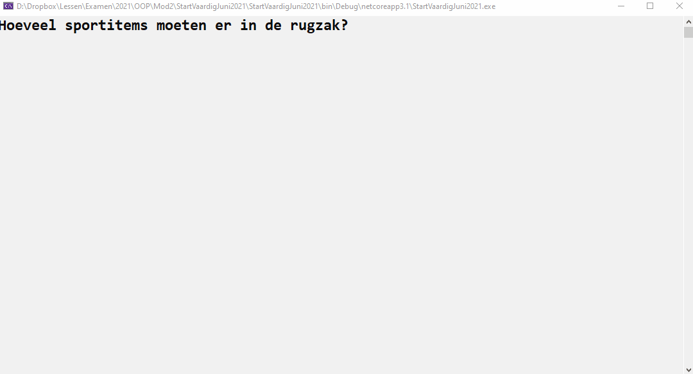


Volgende opgave was de vaardigheidsproefopdracht voor het 1e zit examen van dit vak (OOP) in juni 2021



# Introductie

De sportleraar is nogal slordig. Hij verliest altijd zijn dure drinkbussen. De school heeft daarom jouw diensten ingehuurd om een deel van het materiaal eenvoudig terug te vinden.


Volgende filmpje toont de volledige werking van de applicatie:



## Context

Een sportleraar kan een rugzak met 2 soorten items vullen:

1. Niet trackable items (ballen, fluitje, etc).
2. Drinkbussen die wel getrackt kunnen worden.

De rugzak zelf is ook trackable en zal zelfs kunnen aangeven op welke hoogte deze zich bevindt.

Om het leuk te maken zullen de posities van de trackable items (drinkbussen en rugzakken) telkens veranderen wanneer je ze aanroept.

De spullen die je in een rugzak plaats zullen zich in het progamma niet op dezelfde locatie als de rugzak zelf bevinden, daar alle trackable elementen (rugzak en drink) steeds nieuwe willekeurige locaties krijgen (beeld je in dat de leraar de rugzak vult, ermee naar het park vertrekt, uitlaadt en nu geraken alle spulletjes zoek in het park)

## De nodige klassen

### GPSLocation

Maak een klasse ``GPSLocation`` met volgende zaken:

* 2 autoproperties, type int, genaamd ``Latitude`` en ``Longitude``
* Een overloaded constructor waarmee je de Latitude en Longitude kunt instellen.
* Een default constructor die de Latitude en Longitude instelt op telkens een random getal tussen 1 en 9.
* ``ToString`` wordt overschreven en output het object als volgt ``Latitude: 4, Longitude: 6``  (met de getallen natuurlijk de effectieve waarde van de properties van dat object).

### AdvancedGPSLocation

Maak een klasse ``AdvancedGPSLocation``. Deze klasse is een ``GPSLocation`` met als extra's:

* Een autoproperty ``Heigth``.
* Een overloaded constructor die niet naast Latitude en Longitude ook de Height vereist.
* Een default constructor die standaard de hoogte op 1 zet en de Longitude en Latitude instels op telkens een random getal tussen 1 en 9.
* ``ToString`` toont ook de hoogte nu, bijvoorbeeld: ``Latitude: 4, Longitude: 6, Height: 5``.

### ITrackable

Maak een interface ``ITrackable`` die één methode ``GetCurrentLocation`` bevat, die een ``GPSLocation`` als returntype heeft en geen parameters verwacht.

### SportItem

Een klasse die enkel ``ToString`` overschrijft om de tekst ``"een eenvoudig sportitem"`` terug te geven.

### Drinkbus

Maak een klasse ``Drinkbus``die een ``SportItem`` is en die de ``ITrackable`` interface implementeert.

Een drinkbus zal steeds een nieuwe willekeurige locatie teruggeven bij ``GetCurrentLocation`` en zal in ``ToString`` de tekst ``"een drinkbus"`` teruggeven.

### Rugzak

Maak een klasse ``Rugzak`` die de ``ITrackable`` interface implementeert.

* De klasse geeft een nieuwe willekeurige ``AdvancedGPSLocation`` terug telkens ``GetCurrentLocation`` wordt aangeroepen.
* De klasse heeft een ``Dictionary`` van sportitems (de rugzakinhoud) waarbij een string als key van ieder item zal gehanteerd worden.
* De rugzakinhoud (de Dictionary) is bereikbaar via een full property.
* De klasse overschrijft ``ToString`` zodat informatie als volgt op het scherm verschijnt (onderaan voorbeeld). *Tip:Gebruik maximaal de ``ToString``-methode van objecten*:
	1. Eerst wordt er een zin gegeven die de huidige locatie van de rugzak toont.
	2. Vervolgens wordt ieder sportitem in de rugzak onder elkaar geschreven (met de tostring van ieder sportitem) en de key.
	3. Indien een sportitem in de rugzak ``ITrackable`` heeft dan zal de locatie van het sportitem met ``GetCurentLocation`` aangeroepen worden om ook deze informatie te tonen.

Een voorbeeld van de ``ToString`` methode output van een rugzak met daarin een drinkbus en een gewoon sportitem:

```text
Rugzak op locatie:  Latitude:1, Longitude:9, Height:1
 Met inhoud:
                mijndrinkbus (Een drinkbus)
                        -Laatste locatie is Latitude:3, Longitude:5
                bal (Een eenvoudig sportitem)
                        -Geen tracker aanwezig
```
(`` mijndrinkbus`` en ``bal`` zijn de keys van ieder sportitem)

* De klasse heeft een methode ``Visualiseer`` wanneer deze wordt aangeroepen (geen parameters) zal deze de inhoud van de rugzak én de rugzak zelf op het scherm tonen aan de hand van lettertjes, als volgt:
    * De GPSLocation coordinaten (Latitude en Longitude) stellen de coordinaten voor waar op het scherm het element komt (Latitude geeft de kolom weer, Longitude de rij in de console). Op die plek zet je een letter:
        * ``r`` voor een rugzak
        * ``D`` voor een drinkbus
    * Merk op dat deze methode telkens een andere 'kaart' zal tonen, daar de GPSlocaties bij iedere aanroep van GetCurrentLocation veranderen (willekeurig).
    * Indien meerdere elementen op dezelfde locatie staan dan wordt gewoon 1 letter getoond (van het laatste element dat op deze plek diende gevisualiseerd te worden).

Een voorbeeld van de uitvoer van de Visualiseer-methode indien we een rugzak hebben op locatie (2,3), met daarin 1 drinkbus op (4,4) en 1 drinkbus op (5,6):

```text

  r

   D
     D
```

## Main

Schrijf een applicatie die als volgt werkt:

1. Maak een nieuwe rugzak aan.
2. Vraag aan de gebruiker hoeveel sportitems in de rugzak moeten komen.
3. Per sportitem dat in de rugzak komt maak je een willekeurig sportitem aan (``SportItem`` of ``Drinkbus``, beide 50% kans om gekozen te worden) en vraag je vervolgens de key waarmee dit sportitem in de rugzak-dictionary moet bewaard worden.
4. Vervolgens start er een loop die oneindig blijft doorlopen die telkens:
    1. Het scherm leegmaakt
    2. De inhoud van de rugzak op het scherm toont in tekstvorm (via ``ToString``)
    3. Wacht tot de gebruiker op enter duwt.
    4. Het scherm leegmaakt
    5. De ``Visualiseer`` methode van de rugzak aanroept.
    6. Wacht tot de gebruiker op enter duwt.

Merk op dat de locaties die in stap 2 getoond worden niet overeenkomen met de locaties die bij de visualisatie in stap 5 worden gebruikt.