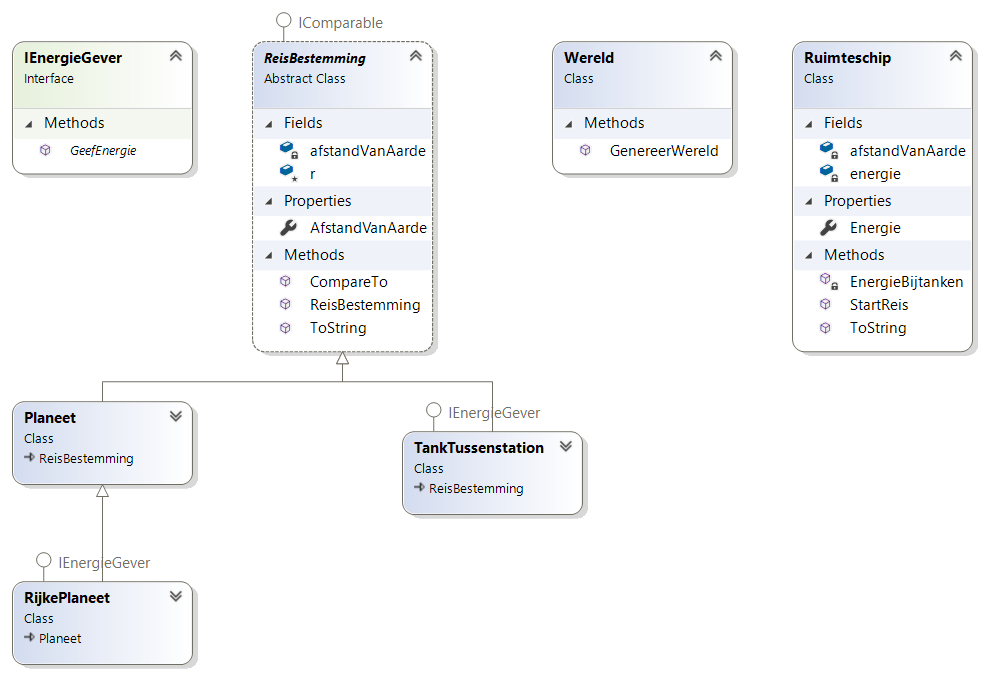

> Volgende opgave was de vaardigheidsproefopdracht voor examen van dit vak (OOP) in augustus 2021

# Inleiding

Knap hoor! We zijn er in geslaagd om eindelijk de aarde voorgoed achter ons te laten en naar nieuwe planeten, ver weg, te reizen. Voor we onze kostbare mensen de ruimte insturen heeft NASA en ESA jou gevraagd om een ruimte-reis-simulatie-pakket te maken. Hopelijk toont jouw applicatie aan dat onze raketten ver genoeg zullen geraken!

# Algemene werking

Een ruimteschip zal in de simulatie vertrekken vanop aarde met een gegeven energie aan de start. Voorts wordt er een fictieve route van planeten en tussenstations aangemaakt waar de rakket, soms, kan bijtanken. 


De applicatie bestaat uit 2 delen (**we gaan verderop in de opgave in op de details van ieder deel**)

## Deel 1
Eerst wordt de fictieve wereld, de reisweg, aangemaakt die de tussenstops in volgorde toont. Er wordt telkens getoond om wat voor tussenstop het gaat en hoeveel lichtjaren de stop van de aarde verwijderd is. Voorbeeld:

```text
Dit is je reisplan:
        RijkePlaneet:1684
        RijkePlaneet:1703
        RijkePlaneet:1911
        Planeet:3230
        TankTussenstation:4067
        Planeet:5339
        TankTussenstation:5642
        TankTussenstation:6765
        TankTussenstation:7016
        TankTussenstation:9504
```

Vervolgens toont de applicatie de startsituatie van het ruimteschip (dat altijd met 3000 energie begint):

```text
Dit is je schip:
Je hebt 3000 energie en bent 0 units verwijderd van de aarde.
```

## Deel 2

Vervolgens zal de simulatie een rakket dit traject laten vliegen. Dit gebeurt automatisch. Op plaatsen waar getankt kan worden (RijkePlaneet en TankTussenstation) zal het ruimteschip dit sowieso doen en dan verder vliegen. Wanneer het ruimteschip niet meer genoeg energie heeft om de volgende etappe af te leggen dan stopt de simulatie daar.

**Eén lichtjaar reizen kost 1 energie.**

Voorbeeld van de uitput (gegeven het voorbeeld in deel 1 hierboven):

```text
De reis gaat van start:

We proberen te reizen naar bestemming 1
Bestemming bereikt. Nog 1316 energie over.
Laten we proberen bij te tanken
Hier werd bijgetankt. Je kreeg 168 energie en staat nu op 1484 energie.

We proberen te reizen naar bestemming 2
Bestemming bereikt. Nog 1465 energie over.
Laten we proberen bij te tanken
Hier werd bijgetankt. Je kreeg 170 energie en staat nu op 1635 energie.

We proberen te reizen naar bestemming 3
Bestemming bereikt. Nog 1427 energie over.
Laten we proberen bij te tanken
Hier werd bijgetankt. Je kreeg 191 energie en staat nu op 1618 energie.

We proberen te reizen naar bestemming 4
Bestemming bereikt. Nog 299 energie over.
Laten we proberen bij te tanken
Hier kan niet bijgetankt worden

We proberen te reizen naar bestemming 5
Dit schip heeft niet genoeg energie daarvoor.
De reis eindigt hier.
Je hebt 299 energie en bent 3230 units verwijderd van de aarde.
Je bent tot aan bestemming 5  geraakt met info: TankTussenstation:4067
```

## Opbouw

### Klasse diagram

Volgende diagram toont alle klassen en interfaces die je moet maken:



**We beschrijven nu de individuele klassen in de volgorde dat je ze best maakt, uiteraard ben je vrij om een andere vologrde te hanteren**

#### IEnergiegever

Plekken waar het ruimteschip zal kunnen tanken hebben deze interface. De interface is als volgt gedefinieerd:

```csharp
interface IEnergieGever
{
    long GeefEnergie();
}
```


#### Reisbestemming

Deze abstracte klasse wordt gedefinieerd door de afstand (in lichtjaren) van de aarde. Enkele opmerkingen:

* ``r`` is een ``static`` ``Random``-object zodat je dat overal kan gebruiken
* heeft een read-only property ``AfstandVanAarde``
* heeft een constructor die de instantievariabele ``afstandVanAarde`` op een willekeurig getal tussen 400 en 10.000 zet.
* heeft de ``IComparable``-interface en zal toelaten om (later) een lijst van Reisbestemmingen te sorteren op hun afstand van de aarde (zie verder).
* heeft de ``ToString``-methode geïmplementeerd en geeft het object weer als [Type object]:[Afstand van Aarde], bijvoorbeeld ``RijkePlaneet:1911`` (zie de output deel 1 bovenaan).
    * Tip: met  de ``GetType().Name`` property krijg je het type terug zonder de overbode namespace ervoor.

#### Planeet

Een ``Planeet`` is een ``Reisbestemming``. Niets meer.

Ter info: er kan dus niet getankt worden daar het niet de ``IEnergieGeven``-interface heeft.

#### RijkePlaneet

Een ``RijkePlaneet`` is een ``Planeet`` die de ``IEnergieGever``-interface heeft. Dit type planeet geeft altijd 10% terug van de afstand tot de aarde. Als de planeet zich dus op 3246 lichtjaren bevind dan zal ``GeefEnergie`` 324 energie teruggeven.

#### TankTussenstation

Een ``TankTussenstation`` is een ``Reisbestemming`` die de ``IEnergieGever``-interface heeft. Dit type geeft altijd een willekeurige hoeveelheid tussen 500 en 1500 energie terug bij ``GeefEnergie``. **Deze waarde is steeds anders telkens de methode wordt aangeroepen.**


####  Wereld

Deze klasse heeft één methode met volgende signatuur:

```csharp
public static List<ReisBestemming> GenereerWereld(int aantal)
```

De methode geeft een lijst van ``Reisbestemming``-en terug. De parameter ``aantal`` geeft aan hoeveel objecten in de lijst zitten.

De methode plaats een combinatie van ``Planeet``, ``RijkePlaneet`` en ``TankTussenstation``-objecten in de lijst. Het kiest willekeurig uit deze 3 types volgende volgende tabel:

* 25% kans op een ``Planeet``
* 25% kans op een ``RijkePlaneet``
* 50% kans op een ``TankTussenstation``

Finaal wordt de lijst gesorteerd waarbij de ``Reisbestemming`` die het dichts bij de aarde zit van voor komt,  en zo verder. Deze gesorteerde lijst wordt als resultaat van de methode teruggegeven.

**Tip: weet je niet hoe je moet sorteren? Geen probleem, geef gewoon de ongesorteerde lijst terug en werk hier op verder! (verlies dus niet te veel tijd met dit stuk)**

#### Ruimteschip

Deze klasse heeft:

*   Een read-only property met private set om de ``Energie``(type: ``long``) bij te houden.
    * Een ruimteschip heeft altijd 3000 energie aan de start.
* Een instantievariabele ``afstandVanAarde`` die bijhoudt hoeveel lichtjaren van de aarde het schip is.
    * Deze start altijd op 0 (daar we op aarde vertrekken).
* De methode ``ToSTring`` die volgende zinnetje teruggeeft ``Je hebt [Energie] energie en bent [afstandVanAarde] units verwijderd van de aarde.`` (met natuurlijk de effectieve waarden in plaat van de placeholders met vierkante haken). Voorbeeld ``Je hebt 294 energie en bent 3489 units verwijderd van de aarde.``

De klasse heeft twee speciale methode:

**``StartReis``**: 

Deze methode geeft een ``bool`` terug en aanvaardt een ``Reisbestemming``-object als parameter. De methode werkt als volgt:

* Het geeft met de bool weer of het schip genoeg energie heeft om naar de reisbestemming te reizen. Een schip kan enkel naar die plek, het *doelwit*, reizen (de parameter) indien deze minstens evenveel energie heeft als het aantal lichtjaren dat het schip van de planeet verwijderd is. 
* De te reizen afstand is natuurlijk het verschil tussen de ``afStandVanAarde``-instantie van het ruimteschip en de ``AfstandVanAarde`` van de bestemming.
    * Als het schip op afstand 2000 is van de aarde en het doelwit is op 2500 afstand van de aarde, dan heeft het schip 500 (2500-2000) energie nodig.
* Indien het schip niet genoeg energie heeft dan wordt er ``false`` teruggegeven nadat volgende zin op het scherm komt: ``"Dit schip heeft niet genoeg energie daarvoor."``
* Indien het schip wél genoeg energie heeft dan wordt de energie van het schip verminderd met de zonet berekende hoeveel energie die gegeven de afstand tussen beide nodig was (dus 500 in vorig getalvoorbeeld) en worden volgende 2 zinnen getoond: ``Bestemming bereikt. Nog [Energie} energie over. Laten we proberen bij te tanken. ``
    * Vervolgens wordt de ``afstandVanAarde`` verhoogt met de afgelegde afstand (namelijk de gespendeerde energie)
    * **Voor je nu ``true`` teruggeeft (om aan te geven dat de reis gelukt is) roep je nu de methode ``EnergieBijtanken``(zie volgende stuk) en geeft de doelwit ``Reisbestemming`` mee als argument.**

**``EnergieBijtanken``** 

Deze methode geeft niets terug en aanvaardt een ``Reisbestemming``-object als parameter. De methode werkt als volgt:

* Indien het meegeven object de ``IEnergieGeven``-interface heeft dan zal het schip hiervan gebruik makenen bijtanken. Het roept hierbij de ``GeefEnergie``-methode van het doelwit op en zal de teruggekregen energie optellen bij z'n huidige energie en vervolgens volgende zinnetje tonen: ``Hier werd bijgetankt. Je kreeg [verkregenEnergie] energie en staat nu op [Energie] energie.`` Vervolgens stopt de methode.
* Indien er op het object niet kan getankt worden verschijnt er ``Hier kan niet bijgetankt worden`` en stopt de methode.

## Main code

Het wordt nu tijd om alles samen te gooien. Dat gaat hopelijk eenvoudig. 
Het hoofdprogramma werkt als volgt:

* Een nieuwe wereld wordt aangemaakt mbv van de ``GenereerWereld``-methode van de ``Wereld``-klasse
* Ieder tussenstop van deze nieuwe wereld wordt op het scherm getoond (zie voorbeeld uitvoer vooraan de opgave)
* Een nieuw RuimteSchip-object wordt aangemaakt en ook op het scherm getoond.
* De reis gaat van start. Hierbij wordt een loop gestart die blijft duren:
    * zolang het schip nog energie heeft (dus meer dan 0),
    * zolang een teller minder is dan het totaal aantal bestemmingen in de wereld
    * zolang het schip nog genoeg energie heeft om naar de volgende bestemming te gaan
    * In de loop houdt je met een teller bij aan welke bestemming je bent en verhoogt deze teller telkens het schip naar de volende bestemming reist.
* Finaal toon je tot waar het schip is geraakt. 

Volgende voorbeeldoutput toont nogmaals het geheel:

```text
Dit is je reisplan:
        TankTussenstation:1401
        RijkePlaneet:1519
        TankTussenstation:2390
        Planeet:4167
        TankTussenstation:5736
        TankTussenstation:6386
        Planeet:6426
        Planeet:6466
        RijkePlaneet:9646
        RijkePlaneet:9872

Dit is je schip:
Je hebt 3000 energie en bent 0 units verwijderd van de aarde.

De reis gaat van start:

We proberen te reizen naar bestemming 1
Bestemming bereikt. Nog 1599 energie over.
Laten we proberen bij te tanken
Hier werd bijgetankt. Je kreeg 788 energie en staat nu op 2387 energie.

We proberen te reizen naar bestemming 2
Bestemming bereikt. Nog 2269 energie over.
Laten we proberen bij te tanken
Hier werd bijgetankt. Je kreeg 151 energie en staat nu op 2420 energie.

We proberen te reizen naar bestemming 3
Bestemming bereikt. Nog 1549 energie over.
Laten we proberen bij te tanken
Hier werd bijgetankt. Je kreeg 838 energie en staat nu op 2387 energie.

We proberen te reizen naar bestemming 4
Bestemming bereikt. Nog 610 energie over.
Laten we proberen bij te tanken
Hier kan niet bijgetankt worden

We proberen te reizen naar bestemming 5
Dit schip heeft niet genoeg energie daarvoor.
De reis eindigt hier.
Je hebt 610 energie en bent 4167 units verwijderd van de aarde.
Je bent tot aan bestemming 5  geraakt met info: TankTussenstation:5736
```