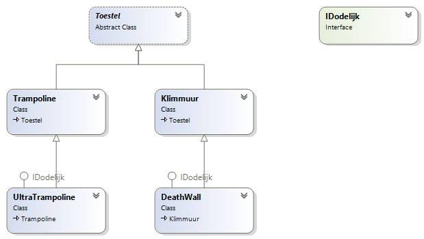
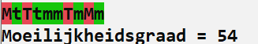
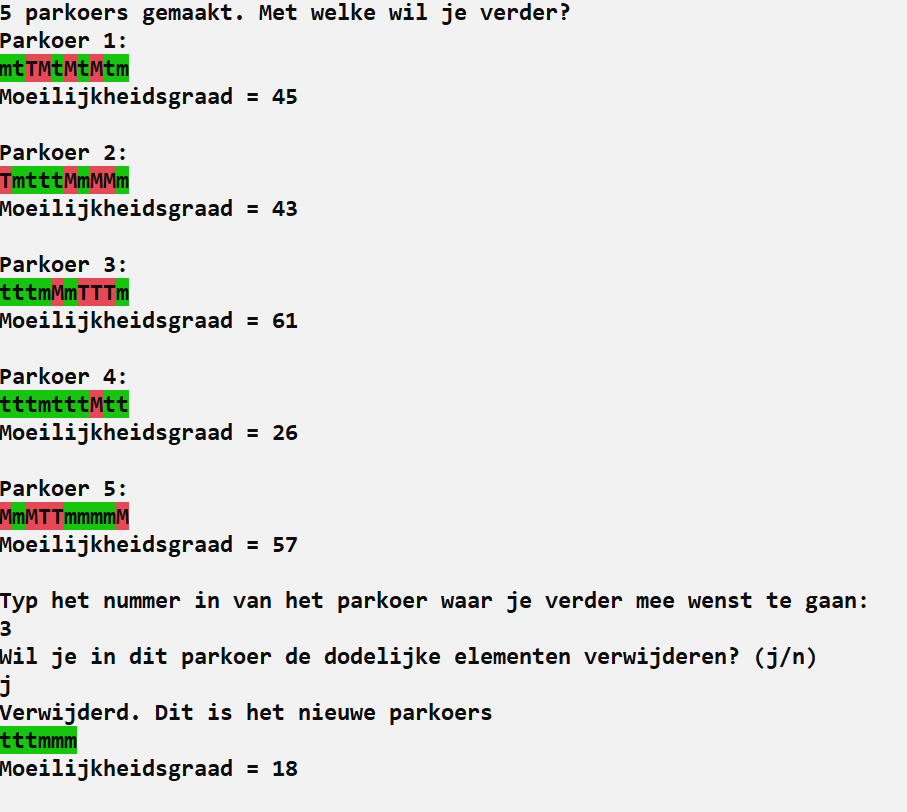

> Volgende opgave was de vaardigheidsproefopdracht voor het inhaalexamen van dit vak (OOP) in augustus 2021

# Intro

Ultimate Beast Master is een populaire, Amerikaanse, tv-show waarin topatleten een ongelooflijk zware obstakelkoers zo snel mogelijk moeten afleggen. Enkel de sterkste, meest atletische mannen en vrouwen slagen er in om het einde van het parkoers te bereiken. 

Als organisator van de tvshow wordt je gevraagd om een systeem te ontwikkelen waarin een parkoers kan gegenereerd worden waarvan ook de moeilijkheidsgraad kan berekend worden.

## Basisklassen

Eerst gaan we de nodige toestellen maken om dan later een parkoers van toestellen aan te leggen volgens volgende klasse:



### IDodelijk interface

Deze interface is als volgt: 

```csharp
interface IDodelijk
{
    public bool VeiligheidsActief { get; }
}
```

Toestellen die mogelijk dodelijk zijn, zullen deze interface hebben.

### Toestel-klasse

Alle toestellen die in een parkoers voorkomen zullen van deze klasse overerven.

Het gaat om een abstracte klasse met:

* Een protected instantievariabele ``tekenChar`` dat standaard ``o`` is. Dit teken zal gebruikt worden om het toestel te visualiseren.
* Methode ``Teken`` die het ``tekenChar`` op de huidige plek in de console schrijft (met ``Write``).
* Een abstracte methode ``BerekenMoeilijkheidsgraad`` die een ``int`` als resultaat heeft en geen parameters aanvaardt.


### Trampoline-klasse

* Is een ``Toestel``.
* Heeft een default constructor:
  * die de moeilijkheidsgraad van het object op een willekeurige waarde geeft van 1 tot en met 4 (dat vervolgens in ``BerekenMoeilijkheidsgraad`` zal gebruik worden). 
  * het ``tekenChar`` wordt op een ``t`` ingesteld.

### UltraTrampoline-klasse

Een Ultratrampoline is een trampoline die gevaarlijk is. Er is geen mogelijkheid om netten rond het ding te plaatsen, dus deze klasse verdient zeker de term *dodelijk*.

De klasse:

* Is een ``Trampoline``.
* Heeft een default constructor die het ``tekenChar`` op ``T`` instelt.
* Implementeert de ``IDodelijk`` interface en zal altijd ``false`` teruggeven bij ``VeiligheidsActief`` (de beveiligingsinstelling van een Ultratrampoline kan dus nooit anders zijn).
* De moeilijkheidsgraad van deze klasse is *"10 + de waarde die in de default constructor van de ``Trampoline``werd berekend"*.

### Klimmuur-klasse

Een klimmuur wordt gedefinieerd door het aantal handvaten die de muur heeft.

De klasse:

* Is een ``Toestel``.
* Heeft een overloaded constructor waarmee het aantal ``klimelementen`` (handvaten) kan ingesteld worden via een meegegeven ``int``. De ``tekenchar`` is een ``m``.
* De moeilijkheidsgraad is 3 indien er een even aantal ``klimelementen`` zijn, anders is deze 4.

### DeadWall-klasse

De dodelijk deadwall is een klimmuur waar eventueel veiligheidsnetten onder kunnen geplaatst worden zodat deelnemers die vallen opgevangen kunnen worden.

* Is een ``Klimmuur``.
* Heeft een default constructor waarmee kan ingesteld worden of de wall met veiligheidsnetten werkt of niet (aan de hand van een meegegeven ``bool``). Een ``DeadWall``heeft altijd ``21`` klimelementen. ``tekenchar`` is ``M``.
* Implementeert de ``IDodelijke`` interface en zal de ``bool`` teruggeven in ``VeiligheidsActief`` die in de constructor werd meegegeven.
* De moeilijkheidsgraad is 5 indien er veiligheidsnetten zijn, anders is deze 10.


## Parkoer-klasse

Deze klasse beschrijft een volledig parkoers van toestellen die de speler zal moeten bedwingen in de Ultimate Beast Master tv-show.

* Deze klasse heeft een lijst van toestellen.
* Een constructor die 2 parameters aanvaard, namelijk het aantal toestellen (*x*) waaruit het parkoers bestaat en een bool  (*y*) om aan te geven of dodelijke toestellen met beveiliging moeten worden toegevoegd:
	* De constructor zal *x* willekeurige toestellen aan de lijst toevoegen. Ieder toestel (`Trampoline`, `UltraTrampoline`, `Klimmuur` en `Deathwall`) heeft even veel kans om gekozen te worden.
	* Indien een `Klimmuur` wordt gekozen dan krijgt deze een willekeurig aantal klimtoppen tussen 10 en 50.
	* Indien een Deathwall wordt gekozen dan wordt de bool `y` meegeven om aan te geven of er wel of geen veiligheidsnet moet toegevoegd worden.
* De klasse heeft een methode `VerwijderDodelijke`. Wanneer deze methode wordt aangeroepen dan worden alle `IDodelijke` toestellen uit de lijst verwijderd.
* De klasse een private methode `BerekenMoeilijkheidsgraad` die een `int` teruggeeft. De moeilijkheidsgraad van een parkoers bestaat uit de som van de moeilijkheidsgraden van alle toestellen in de lijst.
* De klasse heeft een methode `ToonParkoers` . Deze methode zal alle toestellen na elkaar op het scherm tonen waarbij de achtergrond van ieder element rood of groen zal zijn:
	* Rood indien het een `IDodelijk` toestel is (ongeacht of er veiligheidsnetten aanwezig zijn), groen in de andere gevallen.
    * Nadien wordt ook nog de totale moeilijkheidsgraad van het parkoers getoond.
    * Voorbeeld output: 

## Hoofdprogramma

De hoofdapplicatie bestaat uit volgende stappen

* Eerst worden er 5 willekeurige `Parkoer`-objecten aangemaakt en in een lijst bewaard.
* Vervolgens worden alle `Parkoer`-objecten in de lijst gevisualiseerd.
* De gebruiker kiest met welk parkoer hij verder wilt gaan.
* Er wordt nu aan de gebruiker gevraagd of de dodelijke toestellen uit het parkoers moeten worden gehaald. Indien ja, wordt dit gedaan (alle ``IDodelijke`` objecten worden uit de lijst van het gekozen ``Parkoer`` object gehaald).
* Finaal wordt het gekozen parkoers nogmaals getoond, al dan niet zonder de dodelijke toestellen.

Voorbeeld output: 

