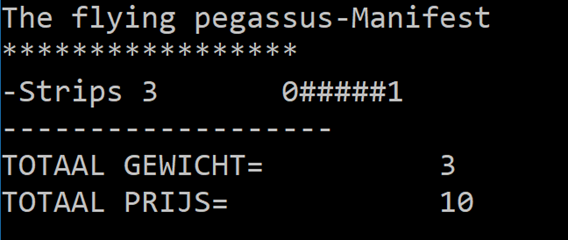
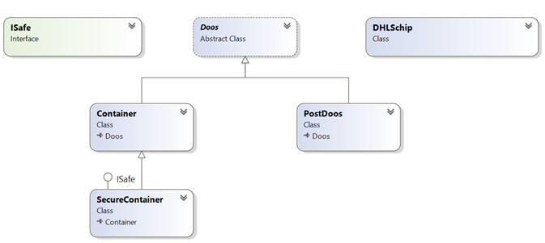
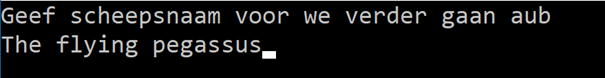
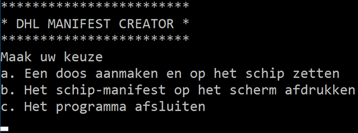
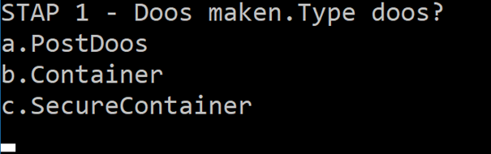
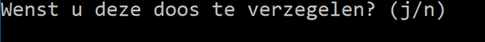
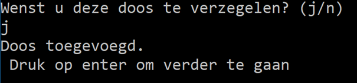
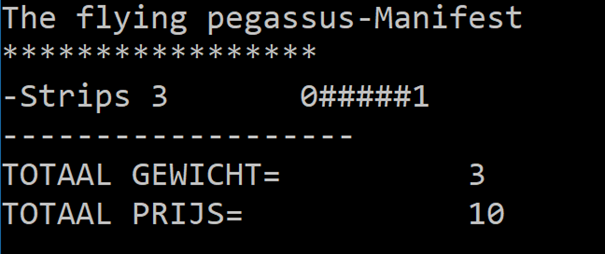

> Volgende opgave was de vaardigheidsproefopdracht voor het examen van dit vak (OOP) in juli 2024

# Introductie
Je firma werd gevraagd om voor een grote rederij een manifest-generator te maken. Wanneer een schip gevuld wordt met dozen en containers dan moet de kapitein ook steeds een manifest hebben. Op dit document (=het manifest) staat welke lading het schip aan boord heeft.

Het bedrijf biedt verschillende soorten dozen aan die de gebruiker kan gebruiken om z’n pakket mee te verzenden. Afhankelijk van het type doos zal de kostprijs anders zijn. 
Voorts biedt het bedrijf een SecureContainer aan. Dit is een doos die kan verzegeld worden. Een verzegelde container heeft als extra eigenschappen dat het ten eerste z’n kostprijs niet zal teruggegeven (zodat dieven niet weten wat de waarde van de inhoud is) en het zal ook onthouden hoe vaak externen de kostprijs van de doos wensen te weten komen. 

 
 


# Deel 1: Klassen-diagram (6 punten)
Maak een nieuw project aan en zorg ervoor dat volgende klassen diagram wordt toegepast:



## Klasse Doos:

```csharp
abstract class Doos
{       
    public Doos(int id)
    {
        ID = id;
    }
    public int ID { get; private set; }
    public int Gewicht { get; set; }
    public string Inhoud { get; set; }
    
    public virtual int KostPrijs
    {
        get { return Gewicht * 10; }
    }
}
```
## Klasse Container

De kostprijs van een Container is de “kostprijs van een Doos + 5”.

## PostDoos

De kostprijs van een PostDoos is altijd 10.
 
## Interface ISafe
ISafe is een interface
ISafe bevat 2 methoden:
VerzegelInhoud: 
* vereist geen parameters en geeft niets terug.
GeefAntalLeesAttempts: 
* vereist geen parameters en geeft een int terug.

## Klasse SecureContainer
GeefAantalLeesAttemps() geeft terug hoe vaak de KostPrijs van het object werd uitgelezen via de get’r.
VerzegelInhoud(): vanaf je dit aanroept zal de container verzegeld zijn. Een verzegelde container zal 0 als Kostprijs teruggeven in plaats van de effectieve kostprijs. (eens verzegeld kan dit niet meer ongedaan gemaakt worden).

## Klasse DHLSchip
Heeft een Lijst van Dozen genaamd vrachtRuim die naar buiten toe beschikbaar is via public get, maar private set.

Heeft een methode VoegDoosToe: 
* vereist 1 parameter van het type Doos en geeft een bool terug.
* zal de doos in de parameter toevoegen aan het Vrachtruim, maar enkel indien het totale gewicht van alle dozen in het vrachtruim niet boven de 10 komt (indien de huidige dozen dus reeds samen 8 wegen, en de nieuw toe te voegen weegt 3 dan zal de doos niet toegevoegd worden):
* Indien een doos te zwaar is zal er een Exception opgeworpen worden met de boodschap: “Te zwaar. Doos niet toegevoegd”.
* Indien de doos wel werd toegevoegd zal er true terug gegeven worden

Heeft een methode ToonManifest:
* Vereist geen parameters en geeft niets terug.
* Deze methode aanroepen zal resulteren in het afdrukken van het manifest naar het scherm. De output hiervan wordt besproken in een later deel van deze opgave.
 
## Deel 2: Manifest output DHLSchip (4 punten)
De ToonManifest()-methode van het DHLSchip zal de volgende output genereren:
* Hoofding: Naam van het schip
* Midden: informatie van de dozen.
   * Start telkens met een minteken, gevolg door de Inhoud van de doos, het gewicht en de kosptrijs ervan.
   * Indien de doos een ISafe interface bevat dan zal er achteraan de informatie van de doos ook de uitvoer van GeefAantalLeesAttempts getoond worden (voorafgegaan door 5 ‘hekjes’ (#)
* Einde:
   * Het totaalgewicht van alle dozen samen wordt getoond
   * De totale prijs van alle dozen wordt getoond:
       *  Per ISafe doos zal er een standaard prijs van 10 worden bijgeteld 
       * Indien de doos Verzegeld is dan zal deze doos dus 0+10 kosten.
       * Een niet verzegelde doos zal dan z’n effectieve prijs + 10 kosten.


Voorbeeld output Manifest van een schip genaamd ‘The flying pegassus’ (Strips zit in een PostDoos, Goud zit in een verzegelde SecureContainer waarvan de kostprijs 1keer werd uitgelezen en Auto zit in een Container):

```text
The flying pegassus-Manifest
*****************
-Strips 	 3       	30
-Goud  	 2      	0#####1
-Auto  	 3       	35
-------------------
TOTAAL GEWICHT=          8
TOTAAL PRIJS=            75
```
 
# Deel 3 : Boot manager  (4p, waarvan) 
Maak nu een console-applicatie die toelaat om dozen op een schip te zetten en vervolgens het manifest te tonen. (screenshots van het programma worden achteraan deze opgave getoond) 

Als volgt:
## Deel 3a: Bootnaam   (0,5 punt)
Eerst wordt de schipsnaam eenmalige gevraagd en wordt een nieuw DHLSchip object met die naam aangemaakt. Vervolgens verschijnt het hoofdmenu.
## Deel 3b: HoofdMenu (0,5 punt)
Een menu wordt getoond dat steeds zal terugkeren tot de gebruiker het programma afsluit. De gebruiker kan 3 zaken kiezen in het menu
a.	Een doos aanmaken en op het schip zetten (zie deel 3c).
b.	Het schip-manifest op het scherm afdrukken (zal ToonManifest van het schip aanroepen).
c.	Het programma afsluiten.

## Deel 3c: Doos aanmaken en toevoegen menu (3 punten)
Dit menu bestaat uit 3 stappen:
a.	Type doos vragen
b.	Gewicht en inhoud vragen
c.	(Optioneel) Doos verzegelen vragen
Vervolgens zal de doos aan het vrachtruim van het schip toegevoegd worden (op voorwaarde dat het schip niet over z’n capaciteit van 10 komt uiteraard)

Stap 1
Indien de gebruiker voor optie a in het hoofdscherm kiest dan zal eerst gevraagd worden wat voor doos moet gemaakt worden:
a.	PostDoos
b.	Container
c.	SecureContainer

Stap 2
De volgende stap wordt gevraagd om de inhoud en het gewicht van de doos. Deze informatie wordt aan de gekozen doos toegevoegd.

Stap 3 (optioneel)
Indien de gebruiker een SecureContainer heeft aangemaakt dan wordt in deze stap gevraagd of de gebruiker de doos wenst te vergrendelen. Bij ja wordt de VerzegelInhoud-methode aangeroepen.

Ongeacht stap 3 zal nu de doos worden toegevoegd, op voorwaarde dat er nog plek op het schip is.
 
# Deel 4: Extra’s (6p, waarvan)
## 5.1	Mooiere output voor Doos  (2 punten)
Zorg ervoor dat je een doos-object naar de WriteLine()-methode kunt sturen als volgt Console.WriteLine(myDoos);, en er een mooie output op het scherm verschijnt, namelijk het doostype, gewicht, kostprijs en inhoud. Bij een SecureContainer wordt er ook nog getoond of de doos is verzegeld of niet.

Voorbeelden:
Output bij Postdoos:
	PostDoos , Gewicht: 2, Prijs: 20,  Strips
Output bij Container:
	Container , Gewicht: 4, Prijs: 45,  Strips
Output bij verzegelde SecureContainer
	SecureContainer , Gewicht: 2, Prijs: 0,  Strips, Verzegeld=ja

## 5.2	VergrendelSnel-methode (2 punten)
Maak in je hoofdprogramma een methode die toelaat om snel alle SecureContainers in een schip te vergrendelen. De methode aanvaard één parameter van het type DHLSchip.
Biedt in je applicatie in het hoofdmenu (3b) als 4e optie “Vergrendel alles” om dit voor de gebruiker te doen.

## 5.3	Bootmanager (2 punten)
Voorzie de mogelijkheid om de gebruiker te laten ingeven om dozen in het VrachtRuim te:
* Verwijderen
* Verplaatsen 
* Vervangen
* Dupliceren  

# Appendix: Voorbeeld programma output
Naam schip, gebruiker voert The flying Pegassus in:

 
Hoofdscherm:
 
Gebruiker kiest a in hoofdscherm:

 
In stap 2 heeft de gebruiker “strips” en 3 (als gewicht) ingevoerd.

 
Gebruiker kiest “j” (om te verzegelen):

 
Gebruiker komt terug op het hoofdscherm en kiest nu optie b om het manifest te tonen:

 

