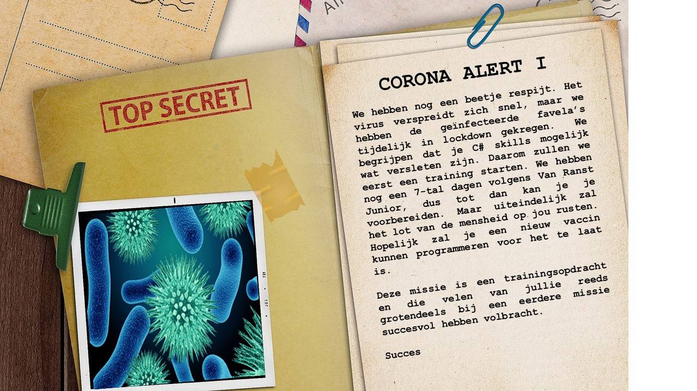

[Briefing](https://learning.ap.be/mod/hvp/view.php?id=271393)

> Welkom terug. Goed te zien dat je de missie zo serieus neemt. Allereerst willen we testen hoe vaardig je C# skills nog zijn. Van zodra je deze opdracht begint door te nemen gelieve een timer te starten. Je mag maximum 120 minuten over deze opdracht doen. Deze tijd is inclusief het lezen van de opdracht en het starten van VS. Je start je timer vanaf de eerste titel hierna leest.

# Start de klok

We maken een applicatie waarmee we vaccins, virussen en vaccinatiecentra gaan simuleren.
In deze wereld heeft ieder virus een "killcode", een verborgen code. Indien een vaccin de juiste killcode heeft dan kan deze gebruikt worden om een virus uit te schakelen. 

## Maak een Vaccin klasse

Deze klasse heeft:

* Een Naam (``string``) als autoproperty met private setter. 
* Enkel een overloaded constructor, waarbij je de naam van het vaccin kunt instellen
* Een methode ``TryKillCode`` die geen parameters aanvaardt en steeds een random getal tussen 1 en 100 teruggeeft 
  * Indien Oplossing een andere waarde dan -1 heeft zal deze methode géén random getal teruggeven maar wel de waarde van Oplossing.
* Een autoproperty ``Oplossing`` van het type ``int`` deze staat standaard op -1.
* Een methode ``ToonInfo`` die de naam van het vaccin en de huidige Oplossing op het scherm zet.

## Maak een Virus klasse

Deze klasse heeft:

* Een Naam als autopoperty met private setter
* Een DoomCountdown (``int``) full property met private setter:
  * Indien doomcountdown 0 of lager wordt gezet zal er "Game over [Naam virus]" op het scherm verschijnen. Dit gebeurt in de setter van de property.
* Een private ``int killcode``
* Enkel een default constructor die:
  * ``DoomCountdown`` op een getal tussen 10 en 20 instelt.
  * killcode op een getallen tussen 0 en 99 instelt
  * Naam wordt willekeurig als volgt: deze bestaat uit 3 willekeurige letters na mekaar, gevolgd door een getal tussen 1 en 99 (bv ABC34).
* Een methode ``TryVaccin`` die:
  * Eén parameter van het type ``Vaccin`` aanvaardt
  * Een bool teruggeeft. Deze zal true zijn indien het meegegeven Vaccin werkt:
    * De methode zal de ``TryKillcode`` aanroepen op het meegegeven Vaccin. Indien het resultaat van TryKillcode overeenkomt met de killcode van het Virus zal er een true teruggestuurd worden. Ook zal vervolgens de property Oplossing van het Vaccin op de geteste én werkende killcode ingesteld worden in het meegegeven Vaccin.
    * Indien de kill code verkeerd is wordt er false teruggestuurd , maar niet voordat eerst de doomcountdown met 1 werd verlaagd.

## Fase 1- zoeken vaccin

We gaan nu op zoek naar het juiste vaccin.

*Maak een virus aan.*

Maak een programma waarin je 5 vaccins aanmaakt en in een lijst plaatst.  Vervolgens ga je deze vaccins blijven testen op een aangemaakt virus en toon je aan de gebruiker welke vaccins werkten. Van zodra je een werkend vaccin vindt stopt de test en moet je onthouden welk vaccin in de lijst werkt.  

Indien de countdown van het virus op 0 komt te staan ben je gameover en heb je geen vaccin gevonden. De gebruiker zal het programma dus opnieuw moeten opstarten en hopen dat er deze keer wel een vaccin kan worden gevonden.

Indien je tijdig een vaccin gevonden hebt ga je naar fase 2.

## Fase 2- Vaccinatiecentra 

### klasse vaccincatiecentrum

Maak een klasse ``VaccinatieCentrum`` aan.

Deze klasse heeft een ``static`` methode ``BewaarVaccin``. Aan deze methode kan je een int als parameter meegeven. Deze parameter wordt in een ``static`` autoproperty genaamd ``Oplossing`` bewaard en bevat de killcode voor het virus die je uit het Vaccin kunt halen via de Oplossing-property dat je aan de methode meegeeft. Standaard staat deze code op -1.

Zorg ervoor dat de Vaccin klasse een extra constructor heeft die toelaat dat je ook een int kunt meegeven die zal gebruikt worden als de oplossing die het vaccin moet maken (en dus reeds vanuit de Oplossing kan uitgelezen worden). De constructor zal dus de property ``Oplossing`` reeds op de juiste waarde zetten. De aanroep van``TryKillCode`` zal dus ook reeds de juiste killcode geven (wat normaal reeds in orde was gebrakt toen je de methode maakte in de eerste plaats).

Maak in de VaccinatieCentrum een methode ``GeefVaccin`` aan die geen parameters aanvaardt en een Vaccin als return type geeft. Deze methode zal null teruggeven in indien ``Killcode`` nog op -1 staat. Indien de killcode een andere waarde heeft dan zal deze methode een nieuw Vaccin teruggeven waarbij de killcode al juist werd gezet.

### Centra verspreiden
We gaan nu VaccinatieCentra over de hele wereld verspreiden. 
Stel eerst via ``BewaarVaccin`` eenmalig in welk vaccin alle centra moeten gebruiken (i.e. het vaccin dat gevonden werd in fase 1)

Plaats nu 5 nieuwe centra aan in je lijst en roep op ieder centra 7x ``GeefVaccin`` aan die een vaccin teruggeeft. Plaats ieder vaccin in een grote lijst.

Overloop finaal de hele lijst (die normaal 35 vaccins moet bevatten) en roep van ieder vaccin de tooninfo op.Je zou nu 35x dezelfde oplossing op het scherm moeten zien. Controleer via een breakpoint of deze oplossing/killcode overeen komt de killcode in je virus dat aan de start van fase 1 werd gemaakt.